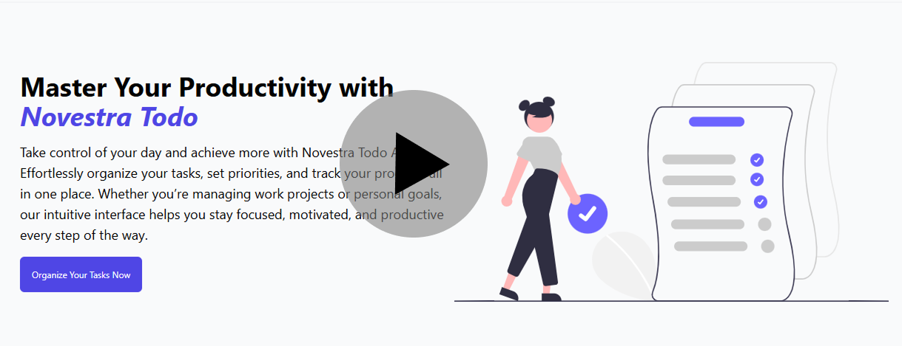

# React frontend app with production grade architecture
## NovestraTodoApp Project Documentation for Frontend

This documentation is designed according to the requirements outlined in the Novestra Full Stack Upskilling Program ToDo App assignment and should accompany the code hosted at [ibrartalab/Todo-App](https://github.com/ibrartalab/Todo-App).

### 1. Objective

The purpose of this project is to demonstrate hands-on, industry-relevant skills in full-stack development by building a robust and maintainable Todo Application. It showcases mastery in modern technologies including:

- **Frontend**: React (with hooks, context, and react-router)
- **Authentication**: custom JWT
- **Testing**: Automated unit tests for both backend (.NET xUnit) and frontend (Jest/React Testing Library)

### 2. User Stories

| As a... | I want to...                                | So that...                                        |
| :------ | :------------------------------------------ | :------------------------------------------------ |
| User    | Register and log in                         | My tasks are private and secure                   |
| User    | Add, edit, delete tasks                     | I can manage my daily activities                  |
| User    | Mark tasks as completed                     | I can track my progress                           |
| User    | Filter tasks by status                      | I can easily find active, completed, or all tasks |
| User    | View a dashboard of completed/pending tasks | I understand my productivity at a glance          |

#### Dashboard

- **Access Dashbaord** `/dashboard/username` — Task stats for dashboard view

### 5. Architecture Overview

- **Frontend** (React):
  - Modular component structure: `TodoList`, `TodoItem`, `Filter`, `Dashboard`
  - CSS or Tailwind CSS for styling
  - Routing with `react-router-dom` (e.g., `/login`, `/dashboard`)
  - State management with Context API or Redux Toolkit
  - API communication via Axios

### 6. Testing

- **Frontend**: Automated unit tests using **Jest** and **React Testing Library**
  - Rendering, state changes, event handling, and API integration (using mocking/stubbing)

## Project Plan: Gantt Chart for Todo App Development

The following day-wise Gantt chart maps milestones and deadlines for each task, starting from Monday, July 21, 2025, to Monday, July 28, 2025. This schedule includes dedicated learning time for C# and .NET Core alongside development tasks.

| Date       | Task                                      | Hours |
| ---------- | ----------------------------------------- | ----- |
| 2025-07-21 | Setup React project                       | 2     |
| 2025-07-21 | Task management UI components             | 2     |
| 2025-07-22 | Setup routing/auth (frontend)             | 3     |
| 2025-07-23 | API endpoints (learning & coding)         | 4     |
| 2025-07-24 | Complete authentication integration       | 3     |
| 2025-07-24 | Write tests (learn testing frameworks)    | 3     |
| 2025-07-24 | Write tests (hands-on)                    | 2     |
| 2025-07-25 | Buffer/Review, Coding best practices      | 2     |
| 2025-07-25 | Testing, Bug fixes                        | 3     |

**Notes:**

- Learning and development tasks are combined daily to support skill acquisition while progressing on project deliverables.
- The final days (July 26–28) are allocated as buffer time for review, additional coding, testing, or demo preparation.
- Daily work hours are balanced between 6 to 8 hours for sustainable progress.

### 8. Deliverables

- **Source Code**: In the specified [GitHub repository](https://github.com/ibrartalab/Todo-App)
- **Documentation**: This file, and in-code comments
- **Database design/ERD**: Included in this documentation
- **API Specification**: Listed above
- **Estimation plan \& timeline**: See section 7
- **Demo Video/Presentation**: Slides or a screen recording of the architecture and main flows

## How to Configure, Run, and Test the Todo App Project

This section helps new users, reviewers, or contributors to quickly get the project running and verify its functionality.

### Prerequisites

- **Node.js** (version 14 or above) and **npm/yarn** installed for frontend dependencies
---

### Project Setup

#### 1. Clone the Repository

#### 2. Setup and Run Frontend React App

- From the project root, go to the frontend folder (e.g., `app`):

```terminal
cd .\app\
```

- Install npm dependencies:

```terminal
npm install
```

- Start the frontend development server:

```terminal
npm run dev
```

```console

- Open a browser and navigate to `http://localhost:3000`.

---

### Configuration

- **Authentication:**
  The app uses Auth0 or a custom JWT solution. Configure authentication in the frontend `.env` file and backend `appsettings.json` or environment variables.
  For Auth0:
  - Set `REACT_APP_AUTH0_DOMAIN` and `REACT_APP_AUTH0_CLIENT_ID` in the frontend `.env` file.
  - Set Auth0 credentials in backend configuration for JWT validation.

- **API URLs:**
  Ensure frontend API base URLs point to the running backend API URLs in `.env` file.


## Project Demo

Watch Demo video
[](https://screenrec.com/share/aulPJZ4yV8)


This template provides a complete overview tailored for submission and demonstration as per the Novestra Full-Stack Upskilling Program requirements. Please adjust technical specifics to match actual implementation in your codebase.
